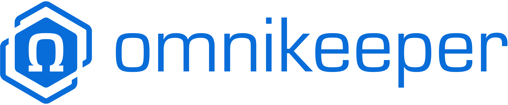

<h1 align="center">
    
</h1>

  omnikeeper

 

Table of Contents

- [About](#about)
- [Getting Started](#getting-started)
- [Contributing](#contributing)
- [License](#license)

---

## About

To Do

## Getting Started

[Follow me to the documentation](https://github.com/max-bytes/omnikeeper/wiki).

### Sample Setup / Test Stack

For a fully functional, self-contained and docker-powered omnikeeper stack that is ready to use, visit https://github.com/max-bytes/omnikeeper-stack

## Contributing

First off, thanks for taking the time to contribute! Contributions are what makes the open-source community such an amazing place to learn, inspire, and create. Any contributions you make will benefit everybody else and are **greatly appreciated**.

Please try to create bug reports that are:

- _Reproducible._ Include steps to reproduce the problem.
- _Specific._ Include as much detail as possible: which version, what environment, etc.
- _Unique._ Do not duplicate existing opened issues.
- _Scoped to a Single Bug._ One bug per report.

Please adhere to this project's [code of conduct](https://github.com/max-bytes/omnikeeper/wiki/meta_code-of-conduct).

You could use [markdownlint-cli](https://github.com/igorshubovych/markdownlint-cli) to check for common markdown style inconsistency.

## License

This project is licensed under the **Apache 2.0 license**.

See [LICENSE](LICENSE) for more information.
